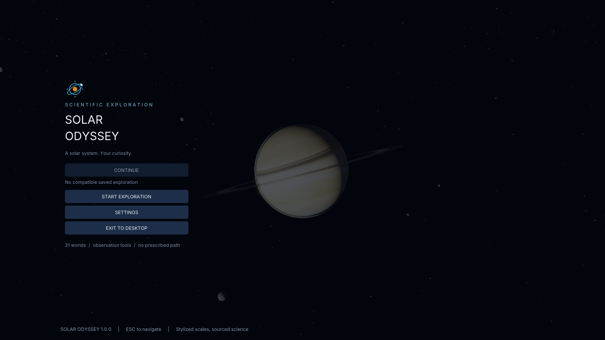
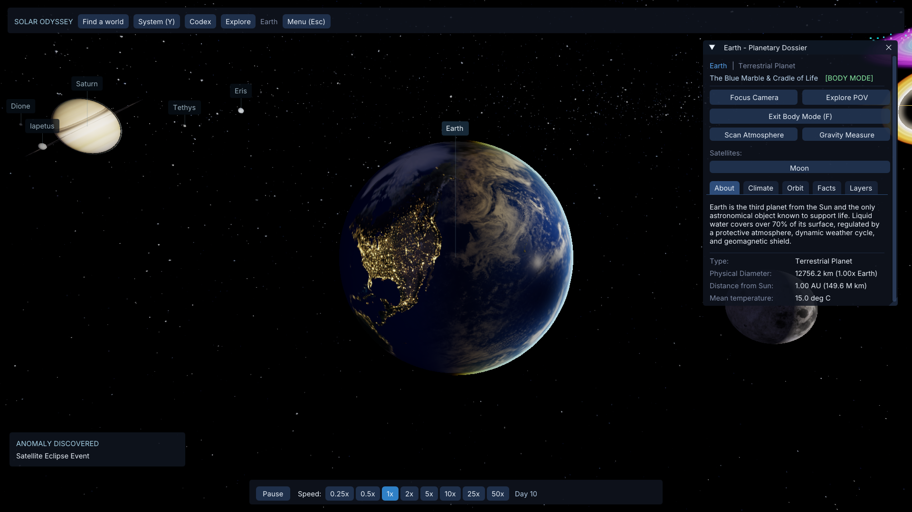
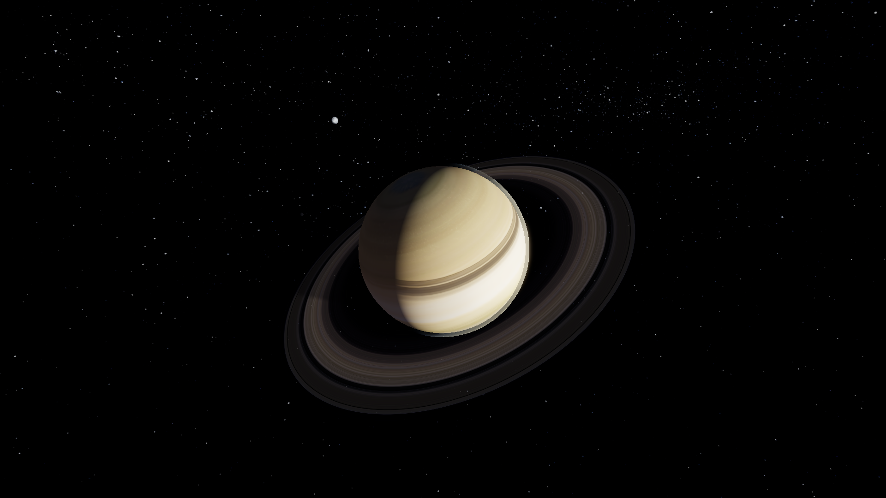
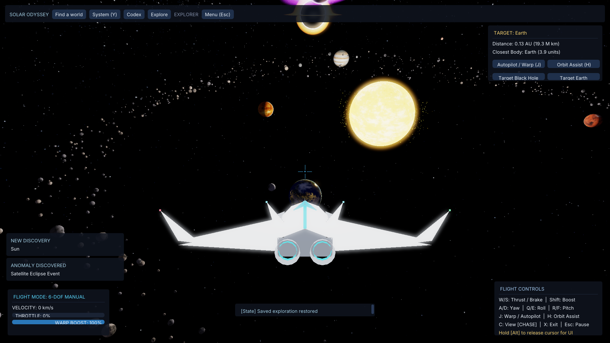
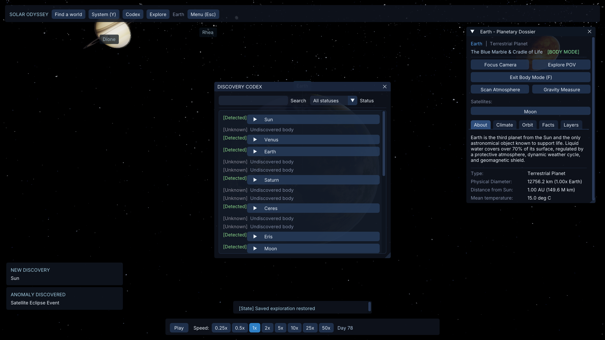
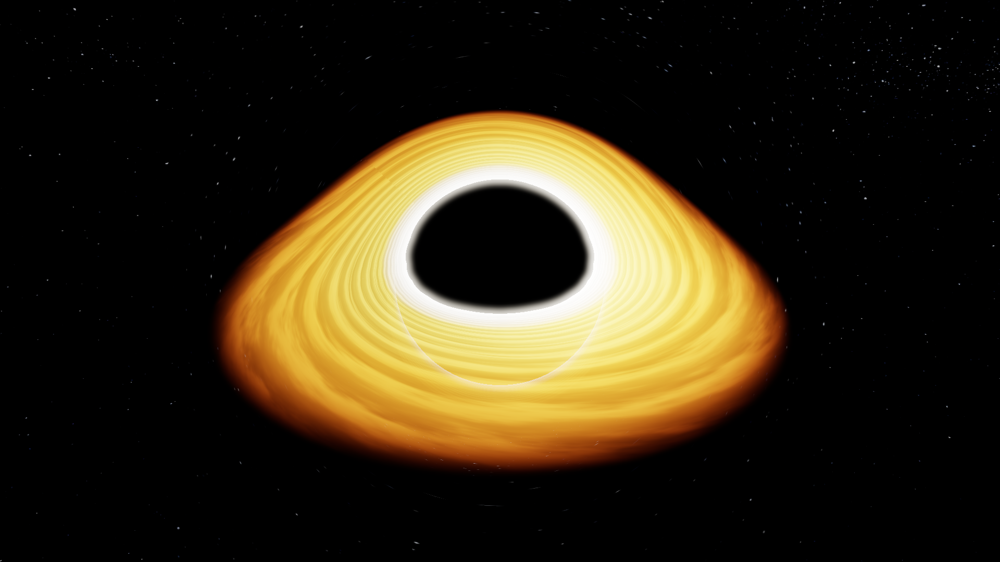

<p align="center"></p>

<p align="center">A solar system. Your curiosity.</p>

**Solar Odyssey 1.0** is a Windows scientific exploration sandbox and C++17/OpenGL graphics showcase by **Yousef Osama**. Explore 31 celestial bodies, pilot a spacecraft, make observations and build a persistent discovery Codex. Choose your own path: there is no campaign, currency or unlock grind.

[Download 1.0 for Windows](https://github.com/YousefE1bana/solar-odyssey/releases/tag/v1.0.0) · [Player guide](docs/PLAYER_GUIDE.md) · [Verification and limitations](docs/RELEASE_1.0_VERIFICATION.md) · [Release notes](docs/RELEASE_NOTES_1.0.0.md)



## Explore, observe, discover

**Explore → Observe → Detect → Visit → Scan → Survey → Photograph → Discover → Learn.**

- Search the roster with **Find world**. Move between Explorer, System and Body presentations with context-preserving selection.
- Inspect planetary dossiers and available Natural, Surface, Atmosphere, Night and Scientific layers. Unsupported layers and unknown facts stay unavailable.
- Fly a 6-DOF spacecraft with cockpit/chase cameras, boost, warp autopilot and orbit assist. Free camera provides another physical observer.
- Detect visible bodies; physically visit, scan, survey, measure gravity and complete flybys. Viewing a distant body never counts as visiting it.
- Photograph genuinely framed targets. Credit follows successful capture/write, and the Codex stores activities, best-photo scores and anomalies.
- Switch independently between Classic stars/Milky Way and catalog-derived Yale, Hipparcos, Tycho or combined Scientific skies.

| Earth and its dossier | Saturn |
| --- | --- |
|  |  |

| Spacecraft | Discovery Codex |
| --- | --- |
|  |  |

Screenshots come from the actual application. The isolated QA profile includes explicit demonstration records in the Codex; fresh player sessions start empty. Captures are converted from BMP to PNG without retouching.

## Install and play

**Windows 10/11 x64**, an OpenGL **4.5 Core** graphics driver and writable user storage are required. The release was exercised on Windows with an NVIDIA RTX 3050 Laptop GPU; other hardware has not been certified.

- **Installer:** run `SolarOdyssey-1.0.0-Windows-Setup.exe`. It installs for the current user, creates Desktop/Start Menu shortcuts and provides an uninstaller.
- **Portable:** extract the entire `SolarOdyssey-1.0.0-Windows-Portable.zip`; launch `SolarOdyssey.exe` inside the extracted folder. Keep its runtime folders and DLLs together. No compiler or developer environment is required.
- Compare downloaded files with `SHA256SUMS.txt` on the release page. The application and installer are unsigned.

Normal launch opens the Main Menu. **Continue** requires a validated save; **Start Exploration** creates a fresh sandbox with confirmation when progress exists. **Esc** opens Pause. Settings belongs to Main Menu/Pause, and pause freezes flight, simulation and observation timers.

Player files are stored in `%LOCALAPPDATA%\SolarOdyssey`: `save_state.json`, `settings.ini` and `Screenshots`. Uninstall preserves them. Installed and portable versions share that profile. `--user-data "C:\path\to\profile"` selects an independent profile.

## Essential controls

| Input | Action |
| --- | --- |
| Mouse drag / wheel | Orbit / zoom |
| Click / double-click | Select / enter Body view |
| Find world; Y; V | Search; System; selected Body view |
| F; R outside ship | Leave Body or toggle free camera; reset Explorer |
| X; W/S | Enter/leave ship; thrust/reverse |
| A/D; Q/E; R/F in ship | Yaw; roll; pitch |
| C; J; H in ship | Camera; warp autopilot; orbit assist |
| G; H outside ship / Shift+H in ship | Atmospheric scan; gravity measurement |
| P; F5/F9; F11 | Photography; save/load; fullscreen |
| Hold Alt in flight | Release cursor for UI |
| Esc | Pause / navigate back / resume |

[The complete guide](docs/PLAYER_GUIDE.md) explains layers, science eligibility and storage. Space pauses the simulation timeline separately from the application Pause Menu.

## Engineering

The renderer uses camera-relative positions, modern OpenGL buffers, HDR targets, bloom and a single final sRGB output transfer. Color textures decode from sRGB; masks/scientific scalar maps remain linear data. Black-hole lensing and wormhole destination passes use explicit render-camera contexts. GPU instance slots retain matching draw ranges and latest-reader fences under timeout.

`SimulationController` owns a double-precision accepted clock and world state. Numerical mode integrates **13 roots**; **18 moons** remain analytic children of current live parents, including retrograde Triton. Bounded integration advances the clock only by accepted steps. Mode changes preserve current positions through analytic phase anchors.

Save version **5** records authoritative continuation, including numerical roots/integration state and analytic anchors. Versions 1–4 remain readable without silently reinterpreting historical time units. Restoration validates before applying through the owning systems and clears transient scans, flybys, scoring history, warp and camera smoothing. Checked same-filesystem replacement protects preceding save/settings files on failure. Tool and partial-startup sessions cannot overwrite player persistence.

Resource owners release GL objects before GLFW context teardown. Automated coverage includes multiple contexts, partial initialization, FBO output, readback, fence state, observation geometry, session pause, science records and save compatibility.



## Scientific boundaries

This is an educational sandbox, **not a dated ephemeris or research instrument**. Analytic orbits are simplified circular motion; scene distances/radii/speeds are stylized. The historical timeline displays five sandbox days per accepted simulation second. It does not predict the real sky.

Physical facts are distinct from render geometry and sourced where practical. Missing values are N/A; Uranus/Neptune temperatures identify their atmospheric 1-bar reference. Black holes, wormholes and warp are bounded cinematic approximations. Audio is synthesized. Scientific stars are a catalog-derived visualization, not an Earth-location planetarium.

Natural moon imagery is approval-gated: partial/projection-uncertain mosaics never become full sphere maps. Four moons have approved maps; fourteen retain neutral albedo. Some approved maps retain source seams. Dwarf-planet art is illustrative/fictional. [Asset notices](THIRD_PARTY_NOTICES.md) identify INOVE's CC BY 4.0 adaptations and JPL/USGS source products; illustrative imagery is not calibrated quantitative data.

## Build from source

Dependencies: CMake 3.20+, Ninja, a C++17 compiler, OpenGL, GLEW, GLFW, GLM and OpenAL. Dear ImGui, Catch2, stb and dr_libs sources are bundled.

For the tested Windows MSYS2 **MINGW64** toolchain:

```sh
pacman -S --needed mingw-w64-x86_64-gcc mingw-w64-x86_64-cmake \
  mingw-w64-x86_64-ninja mingw-w64-x86_64-glew mingw-w64-x86_64-glfw \
  mingw-w64-x86_64-glm mingw-w64-x86_64-openal mingw-w64-x86_64-nsis
cmake -S . -B build-release -G Ninja -DCMAKE_BUILD_TYPE=Release
cmake --build build-release -j 8
ctest --test-dir build-release --output-on-failure
```

On machines without a suitable OpenGL context, `-DHEADLESS_TESTS=ON` selects the CPU/headless suite and explicitly excludes native `[gl]` cases. The default full suite and native runtime QA are required for GPU acceptance; hosted CI does not certify rendering.

CMake refreshes the complete curated runtime asset set on every build, including shaders, fonts, audio and licenses. Source TIFFs, unapproved maps and legacy MP3s are excluded. Do not build directly over the source asset directories.

From PowerShell, with the MSYS2 runtime available:

```powershell
.\tools\package_windows.ps1 -BuildDirectory build-release
```

This checks the Release configuration and executable version, resolves the actual DLL import graph, stages owned runtime files, builds an NSIS installer and writes the ZIP and SHA-256 manifest under `build-release/artifacts`. Paths to the runtime prefix and NSIS can be overridden.

## Verification and performance

The 1.0 verification report records the actual build, tests, native captures, packaged dependency isolation, persistence restart, installer/uninstaller checks and uncapped benchmark samples. FPS uses complete wall frames including swap/poll; CPU submission and asynchronous GPU time are reported separately. These short uncapped samples are not a performance guarantee. See [reproducible commands and measured results](docs/RELEASE_1.0_VERIFICATION.md).

Historical cycle reports remain in the repository as development records. They do not describe the 1.0 acceptance state.

## License and credits

Original code and branding: [MIT](LICENSE), © 2025–2026 **Yousef Osama**, Egyptian Chinese University. Third-party software, font and imagery retain their respective licenses. See [complete credits](THIRD_PARTY_NOTICES.md). Solar Odyssey is not affiliated with NASA, JPL, INOVE or Solar System Scope.
