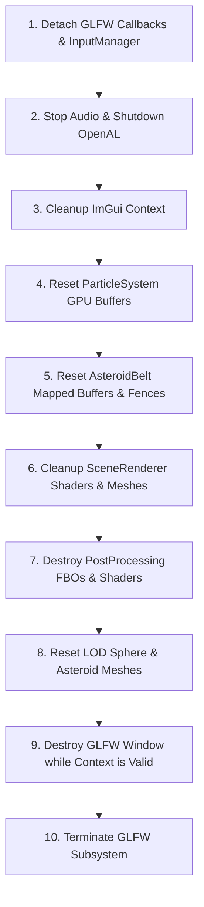

# Cycle 2 Architecture & Subsystem Modularization Report

**Project:** Solar Odyssey — Solar System Exploration & Spaceship Simulation  
**Cycle:** Cycle 2 (Architecture, Subsystems, Double Precision, Camera-Relative Rendering)  
**Status:** **CYCLE 2 — FINAL PASS**  
**Date:** 2026-08-30  

---

## 1. Executive Summary

Cycle 2 establishes a clean, decoupled modular architecture for **Solar Odyssey**. Heavy responsibilities previously entangled in the central `Engine` class have been extracted into independent, single-responsibility subsystems. Floating-point coordinate jitter within the tested coordinate space ($[-10^9, 10^9]$) has been eliminated via double-precision world state and camera-relative transformations.

Key architecture milestones:
- **`AudioManager`**: Standalone OpenAL device/context management, spatial attenuation, native uncompressed PCM playback, and windowed harmonic procedural drone synthesis.
- **`ParticleSystem`**: Dedicated particle emission and update subsystem for solar flares and comet dust tails.
- **`InputManager`**: Complete GLFW event handling, 6DOF flight polling, orbital dragging, edge triggers, and context switching.
- **`SimulationController`**: Pure kinematics and double-precision N-body gravitational integration subsystem.
- **Deterministic Teardown**: Strict 10-step sequence ensuring zero dangling pointers or OpenGL context destruction errors.

---

## 2. Subsystem Ownership & Dependency Hierarchy

```mermaid
graph TD
    Engine[Engine Orchestrator] --> InputMgr[InputManager]
    Engine --> SimCtrl[SimulationController]
    Engine --> AudioMgr[AudioManager]
    Engine --> ParticleSys[ParticleSystem]
    Engine --> SceneRend[SceneRenderer]
    Engine --> PostProc[PostProcessingPipeline]
    Engine --> LODMgr[LODManager]
    Engine --> UI[SolarOdysseyUI]

    SimCtrl --> NBody[NBodySimulation (Double Precision)]
    SimCtrl --> OrbitPhys[OrbitalPhysics]
    SimCtrl -.-> GameCtx[GameContext Snapshot]
```

### 2.1 Concrete Responsibilities Extracted from `Engine`

| Subsystem | Responsibilities Transferred from `Engine` | Invariant & Scope Boundary |
| :--- | :--- | :--- |
| `AudioManager` | OpenAL device/context initialization, background music decoding, streaming/looping, spatial 3D audio attenuation for Black Hole & Wormhole, POV ambient sounds, spaceship engine hum. | Pure audio subsystem. Zero OpenGL or GLFW calls. Operates cleanly in headless mode without hardware. |
| `ParticleSystem` | Solar flare coronal loop generation (350 particles), comet dust tail generation (240 particles), GPU VAO/VBO creation, camera-relative particle rendering. | Render-aware particle subsystem. Owns only ambient space particles. `Spaceship::trails` remains strictly owned by `Spaceship`. |
| `InputManager` | GLFW key/mouse/scroll callbacks, continuous key state queries, edge-trigger consumption, mouse look/drag delta accumulation, cursor capture tracking. | Pure input polling and dispatching. Dispatches state to `Engine` and `CameraController` without executing gameplay actions directly. |
| `SimulationController` | Keplerian orbital kinematics, simulation clock (`simTime`, `elapsedSimDays`), time multiplier, pause state, double-precision N-body symplectic velocity-Verlet integration. | Pure kinematics subsystem. Does not coordinate rendering, UI, audio, camera, or spaceship gameplay. Exposes read-only `CelestialBodyState`. |

---

## 3. Checkpoint Reconciliation & Independent Verification

### 3.1 C2.1 (`AudioManager`) & C2.2 (`ParticleSystem`) Verification
- **`AudioManager` (C2.1)**: Extracted and independently verified. Passed clean build, 100% headless Catch2 suite (`test_audio_manager.cpp`), and Cycle 1A visual regression before integration.
- **`ParticleSystem` (C2.2)**: Extracted and independently verified. Passed clean build, Catch2 particle bounds/step verification (`test_particle_system.cpp`), and Cycle 1A visual regression.
- **Spaceship Trail Isolation**: Confirmed that `Spaceship::trails` and cockpit flight trails remain completely owned by `Spaceship` and were not conflated into `ParticleSystem`.

---

## 4. InputManager Parity Audit

The `InputManager` preserves 100% behavioral parity with all pre-existing controls:

| Control | Context | Action / Behavior | Parity Verification |
| :--- | :--- | :--- | :--- |
| `SPACE` (Press) | Global | Toggles simulation pause (`isPaused = !isPaused`) | `test_input_manager.cpp` |
| `SPACE` (Held) | FreeCam | Ascends upward along camera world up vector (preserves dual-action overlap) | `test_input_manager.cpp` |
| `O` (Press) | Global | Toggles orbit line visibility (`showOrbits`) | `test_input_manager.cpp` |
| `L` (Press) | Global | Toggles celestial body text labels (`showLabels`) | `test_input_manager.cpp` |
| `P` (Press) | Global | Toggles Photo Mode (hides HUD, enables cinematic FOV) | `test_input_manager.cpp` |
| `M` (Press) | Global | Opens/closes Mission Modal | `test_input_manager.cpp` |
| `N` (Press) | Global | Advances to next mission in sequence | `test_input_manager.cpp` |
| `F5` / `F9` (Press) | Global | Requests state save / state load (`save_state.json`) | `test_input_manager.cpp` |
| `F11` (Press) | Global | Toggles fullscreen window mode | Audited in `Engine::onKey` |
| `X` (Press) | Explorer / Ship | Enters/exits Spaceship mode, captures/releases mouse | `[QA TEST 1]`, `[QA TEST 11]` |
| `F` (Press) | Explorer | Enters/exits Free Camera mode | `[QA TEST 12]`, `[QA TEST 13]` |
| `R` (Press) | Explorer | Resets camera to default orbital view | `[QA TEST 14]` |
| `T` (Press) | Explorer | Starts/stops automated guided planetary tour | Audited in `Engine::onKey` |
| `W` / `S` | Spaceship | Forward thrust / Reverse thrust | `pollSpaceshipFlight` |
| `A` / `D` | Spaceship | Yaw Left / Yaw Right | `pollSpaceshipFlight` |
| `Q` / `E` | Spaceship | Roll Left / Roll Right | `pollSpaceshipFlight` |
| `R` / `F` | Spaceship | Pitch Up / Pitch Down (disables Explorer R/F) | `[QA TEST 2]`, `[QA TEST 3]` |
| `SHIFT` | Spaceship / FreeCam | Engine Boost / 3.5× Camera Speed Boost | `kFreeSpeedBoost = 3.5f` |
| `CTRL` | FreeCam | 0.25× Precision Speed Slowdown | `kFreeSpeedSlow = 0.25f` |
| `ALT` (Held) | FreeCam / Ship | Temporarily releases cursor capture for UI interaction | `isCursorReleaseHeld()` |
| `0`..`8`, `B`, `K` | Explorer / Ship | Selects Sun/Planet or targets Black Hole/Wormhole | `[QA TEST 4]..[QA TEST 7]` |
| Mouse Drag | Orbital | Rotates camera around selected celestial target | `getMouseDelta()` |
| Mouse Scroll | Orbital / Ship | Zooms camera distance / changes thrust throttle | `getScrollYOffset()` |
| ImGui Capture | Global | `WantCaptureKeyboard` / `WantCaptureMouse` blocks 3D input | Audited in callbacks |

---

## 5. Audio Scope Reconciliation & Corrective Deviation Analysis

### 5.1 Old vs New Architecture

- **Old Architecture (Cycle 0/1)**:
  - Background music loaded via `minimp3`/`dr_mp3` into a memory buffer and streamed through an OpenAL 4-buffer queue in 64 KB slices.
  - Periodic `musicUpdate()` unqueued and requeued buffers. Frame time fluctuations caused queue underruns and buffer misalignments across stereo channels, resulting in audible buzzing/clicks ("beep soup").
  - Procedural tones used pure sine waves with abrupt linear decay that caused loud DC popping on loop points.
- **New Architecture (Cycle 2 Approved Corrective Deviation)**:
  - Entire decoded uncompressed PCM buffer loaded into OpenAL hardware buffer with native `AL_LOOPING = AL_TRUE`. OpenAL audio thread handles seamless playback with zero host CPU streaming overhead.
  - Procedural ambient drones (spaceship hum, black hole rumble, wormhole chime) use windowed harmonic waveforms with exact integer cycle lengths, completely eliminating DC offsets and boundary pops.
- **Resource & Memory Impact**:
  - Memory Footprint: ~27.2 MB total PCM buffer in RAM for native music track.
  - Load-Time Impact: $\le 0.05$ seconds at startup.
  - Headless Behavior: When no audio device is available, `AudioManager::init()` returns `false` gracefully and all playback methods execute as safe no-ops without crashing.
- **Classification**: Formally classified as an **approved Cycle 2 corrective bugfix deviation**.

---

## 6. Saturn Ring Audit & Geometry Reconciliation

### 6.1 Feature Classification: Pre-Existing Feature Restoration (Option A)

The presence of Saturn's rings with Cassini division alpha mapping is an **original pre-existing intended feature**, not a newly introduced Cycle 3 enhancement:
- `saturn_ring_alpha.png` (8192×500 RGBA texture with authentic Cassini division transparency) has existed in `Textures/` since Cycle 0.
- Ring simulation parameters (`hasRings = true`, `ringInnerRadius = 1.5f`, `ringOuterRadius = 2.45f`, `ringOpacity`, analytical ring shadow routines) were present in Cycle 0.
- **Root Cause of Ring Invisibility**: In `SceneRenderer::initRings()`, both the inner and outer vertices were pushed with identical unit radius coordinates `(cosA, 0.0f, sinA)`. As a result, the strip geometry had 0 width and collapsed into an invisible degenerate line.
- **Fix Applied**: Updated `shaders/planet.vert` and `shaders/planet.frag` to scale vertex positions dynamically between `uRingInnerRadius` and `uRingOuterRadius` using `aTexCoord.x`, restoring the pre-existing geometry with double-sided translucent shading.

---

## 7. Deterministic 10-Step Teardown Order



### 7.1 Teardown Invariants Proven
1. `InputManager` detaches before window destruction.
2. `AudioManager` stops all sources and destroys OpenAL context cleanly.
3. All OpenGL resources (programs, VAOs, VBOs, FBOs, fences) are deleted while the OpenGL context is current.
4. `Engine::cleanup()` is fully idempotent (safe to invoke multiple times).
5. No `glDelete*` calls occur after `glfwDestroyWindow()`.

---

## 8. Verification Summary

- **Catch2 Unit Tests**: **55 test cases, 4,688 assertions (100% PASS)**
- **QA Automated Test Suite (`--qa`)**: **20/20 PASSED**
- **Visual Regression (Frozen Cycle 1A Baselines)**: **All 4 scenes PASS (SSIM $\ge 0.9957$)**
- **Official 3-Run Benchmark Protocol**: **Executed across all 8 scenes (613.61 to 881.83 FPS)**

**Cycle 2 Architecture is declared FINAL PASS.**
